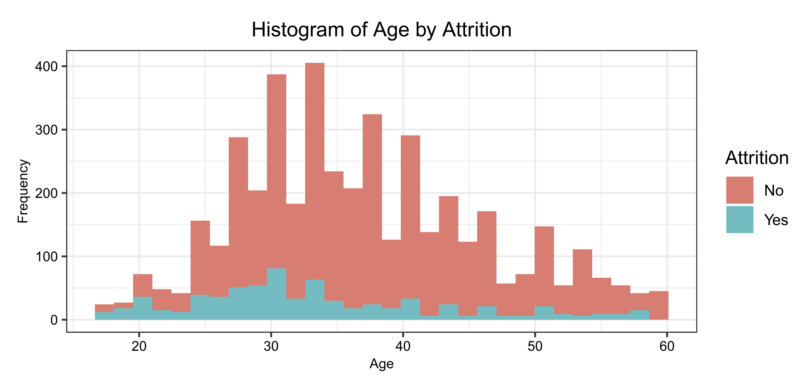
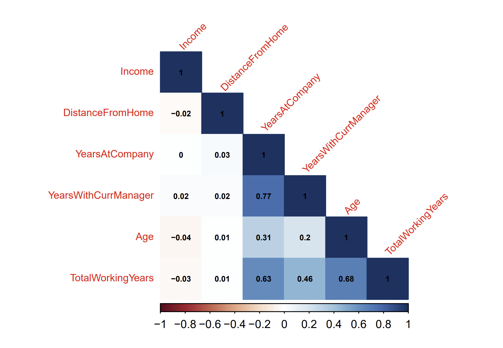

# Canterra Attrition Analysis

## 1 Abstract
This report dives into the issue of the high employee turnover at Canterra, employing an extensive analysis of the dataset provided covering 4410 employees. Through the use of logistic
regression, random forest models, and decision trees, the study aims to identify the underlying
causes of the high attrition rate and proposes actionable strategies for Canterra’s management.
The recommendations focus on improving job satisfaction, modifying business travel policies,
and addressing the specific needs of different employee demographics. The goal of these recommendations is to enhance Canterra’s operational efficiency, with a suggestion for ongoing
evaluation and adaptation of the models to maintain their effectiveness.
## 2 Introduction
In this analysis, we tackle the issue of employee turnover, characterized by the notable annual
attrition rate. Our investigation focuses on identifying the key drivers of this higher turnover
and equipping Canterra’s management with practical, data-driven recommendations to address
these challenges. The report aims to dissect the elements contributing to employee dissatisfaction
and turnover. By exploring these underlying factors, we intend to provide insights and solutions
that will not only mitigate turnover but also enhance operational performance and bolster the
company’s reputation.
## 3 Problem Statement
Canterra faces a significant challenge with their employee turnover rate being high. This high
turnover not only impacts project timelines and the company’s reputation but also necessitates
maintaining a large recruitment department and investing in training for new employees. Due
to the costliness of attrition, it is important to consider how the company can modify the hiring
and training process to ensure that any new employees align with the company and receive the
tools they need to succeed. Above that, we should review what the company can do to ensure
current employees are inclined to stay with Canterra. By analyzing the critical factors leading to
employee attrition at Canterra, we aim to offer strategic recommendations to the management
for reducing turnover and fostering a more stable work environment.
## 4 Methodology
## 4.1 Data Preparation
To encode the target variable as binary, we transformed the “Yes” and “No” responses into a
factor of 1 and 0, such that 1 signifies that attrition occurred. To consider the rest of the data, we
assessed the presence of null values in the JobSatisfaction, TotalWorkingYears,
2
NumCompaniesWorked, and EnvironmentSatisfaction variables. Depending on
the variable type, we replaced null values with the mode and mean. This seemed more appropriate
than omitting them from the dataset, given that 72 observations contained null values.
The raw data also contained several numerical variables that were better suited as categorical.
For instance, TrainingTimesLastYear refers to a discrete count, while Education
and JobLevel assign numbers to a specific level. For all non-continuous numerical variables,
we chose to label-encode responses to facilitate our ability to interpret future models. Variables
such as Age and TotalWorkingYears remained numerical, due to the continuous measure of years. We kept all other variables the same, with the exception of Income, which we
scaled for purposes of normalizing the predictor. Because of the complete homogeneity in the
StandardHours variable and complete heterogeneity in the EmployeeID variable, we excluded them from the analysis entirely. Altogether, our data wrangling process involved thorough cleaning and structuring of the dataset to ensure robust analysis. This resulted in a curated
dataset, optimized for analyzing and deducing determinants.
## 4.2 Exploratory Data Analysis
## 4.2.1 Analysis of Outcome Variable and Potential Predictors
In our exploratory data analysis, a histogram in Figure 1 was created to analyze the distribution of
age among employees and how it relates to attrition. The histogram displays two layers of data,
with one representing employees who have stayed (non-attrition) and the other representing
those who have left (attrition), differentiated by color. It is noticeable that younger employees,
particularly in their late 20s to early 30s, appear to have a higher frequency of leaving, as indicated
by the taller “Yes” bars in this age range. This is further supported by the average age of employees
who left the company being slightly higher than that for employees who stayed, with a mean age
of 33.61 years for attrition versus 37.56 years for non-attrition. Referring back to the histogram,
attrition seems to be less prevalent among the older age groups, with the “No” bars dominating
as age increases. The clear separation of colors allows us to visually assess the extent of attrition
across different age groups, which could potentially signal areas where retention efforts might
be most needed.

Further analysis of the variable reveals a discernible pattern within the organization. In reviewing
the distribution of outcomes, we find that 711 out of 4410 employees have left the company,
translating to 16.12%. The departure of these employees can result in substantial costs for the
company, both financially and in terms of lost productivity and knowledge. Canterra may have
elements that foster retention given that 83.98% of employees choose to stay, yet there are critical
areas that need addressing to reduce the turnover rate. This juxtaposition of the proportion
of employees staying versus leaving provides a quantitative backbone for targeting retention
strategies and could guide the management to focus on the age demographic that exhibits a higher
inclination to leave.
Continuing the analysis, we extended our focus to additional factors that might influence employee turnover, examining variables such as DistanceFromHome and
YearsAtCompany. These factors were visualized through a series of histograms in
3
Figure 2. The commuting distance displays a right-skewed distribution, indicating that most
employees live relatively close to work. Meanwhile, the distribution of YearsatCompany
indicates that the majority of employees have worked at the Company for less than ten years.
These insights, when viewed alongside the age distribution, paint a comprehensive picture
of that workforce’s tendencies, revealing specific demographics and conditions that could be
targeted to improve retention rates and reduce overall attrition.

## 4.2.2 Correlation Between Predictors
The correlation plot in Figure 3 visualizes the relationship between various continuous variables
within the employee dataset. The color intensity and the numerical coefficient within each cell
indicate the strength of the correlation between variables. Notably, YearsatCompany and
YearsWithCurrentManager exhibit a high correlation of 0.77, suggesting a strong positive relationship, where employees who have spent more years at the company also tend to have
more years with their current manager. Another significant correlation is observed between
TotalWorkingTears and Age, with a correlation of 0.68, indicating that as employees age,
their total working years tend to increase, as expected. Ultimately, we found that these correlations should be considered in developing our classification models to avoid potential multicollinearity. However, it is important to note that the Decision Tree and Random Forest methods
do not require independent predictors as logistic regression does.

## 4.2.3 Data Partition
Following the data wrangling phase, we moved to segment the dataset into two subsets: a training
set, which holds 70% of the data and is utilized for training our models, and a test set, comprising
the remaining 30%, which will serve to evaluate the efficacy of the models. This segmentation is
essential for validating the predictive power and generalizability of our analysis.
## 4.3 Logistic Regression
The initiation of our model development began with logistic regression, chosen for its compatibility with our binary outcome variable. This approach is particularly well-suited to our analysis
as it provides a probabilistic framework, assigning a value between 0 and 1 to indicate the likelihood of attrition. The logistic model applies a logit transformation, which effectively extends the
range of our predictions from negative to positive infinity, thus normalizing the response variable
and allowing for a more nuanced interpretation of the predicted probabilities.
## 4.3.1 Manually Selected Model

The first model explores Age, JobSatisfaction, BusinessTravel, and MaritalStatus
as predictors of attrition. Such predictors were determined to be significant through creation
of a preparatory logistic model that considers all variables. While there seemed to be many
4
significant predictors, as indicated by a p-value of less than .05, we isolated these four variables
to (1) minimize the multicollinearity between age and other year-based variables, and (2) reduce
the number of parameters. Through this initial regression, we found that variables such as
income and training times were less significant, amongst others.
Reviewing the first model, it is apparent that there is a negative relationship between age and the
log odds of attrition. As age increases, the first regression model anticipates that the log odds of
attrition will decrease by -.0432. The remaining predictors in the initial model are categorical, and
contain dummy variables to account for one less than the total number of observations within
each category. Though all of the coefficients for these categorical predictors are positive, it seems
individuals who are single, travel frequently for business, or are extremely unsatisfied with their
job are subject to a faster rate in the log odds of attrition. As for the intercept, the value reveals
that the log odds of attrition will be -1.9464 when there the values of all variables are zero, which
is unlikely. The below formula quantifies this model to produce the predicted log odds of attrition:
ln 
P(M)
1 − P(M)

=
−1.946453 − 0.043294 ∗ Age + 0.913061 ∗ JobSatisf action1
+0.609865 ∗ JobSatisf action2 + 0.470890 ∗ JobSatisf action3 + 1.322183∗
BusinessT ravelF requently + 0.688925 ∗ BusinessT ravelRarely + 0.317876 ∗ M arried
+1.167596 ∗ Single
(1)
## 4.3.2 Best Subset Model
Since we initially crafted our logistics model through a manual selection of predictors,
we employed subset regression to identify the most influential variables as determined
by the algorithm. This model contains the same predictors as the first, with additional
variables for YearsWithCurrentManager, YearsWithCompany, JobLevel,
NumCompaniesWorked, TotalWorkingYears, TrainingTimesLastYear,
and EnvironmentSatisfaction. The additional number of variables increases the
complexity of the model, but we can still gather key insights from the coefficients. For instance,
individuals who have worked at many companies have a higher log odds of attrition. Similarly,
individuals who are at the senior level of their job have a negative log odds of attrition.
## 4.3.3 Comparing Logistic Model Performances
The statistics for AIC, log likelihood, and BIC help give us metrics with which to compare models
based on maximum likelihood and complexity, such that the lowest AIC and BIC values and
highest log likelihood value correspond to the best-performing model. Table 1 includes such
metrics for the manually-selected model (“Model 1”) and best subset model (“Model 2”). In all
three instances, the metric prefers Model 1. Model 2 naturally has a higher AIC and BIC, given
that such statistics penalize for more parameters. Overall, the less complex model is preferred.
5
Applying the test data to plot the true positive versus false positive rate provides more insights
into the performance of both models. The ideal model will attain a balance of sensitivity and
specificity, in which the resulting ROC curve will reach the top left corner of the graph. Neither
Model 1 nor Model 2 achieve this standard, but still surpass the .5 threshold. Specifically, Model
1 has an AUC of .7, while Model 2 has an AUC of .75. Ultimately, the increased number of
predictors in Model 2 results in a higher AUC, though we will still rely on the previous metrics
for determining the best-performing model, specifically BIC.
Using Model 1 to develop a confusion matrix, we can assess the details between the true positive
and false positive rate in Figure 4. To do so, we used a standard threshold of .5, in which probabilities exceeding .5 indicate that attrition occurred. Thus, the matrix presents 12 true positives
versus 4 false positives, compared with 1105 true negatives and 201 false negatives. Given the
number of false negatives, it can be inferred that the model is more specific than sensitive. However, we are 95% confident that the accuracy of this model will be between 82.43% and 86.40%.
Though both logistic models establish a strong baseline with which to compare future models,
it is important to consider other classification-based algorithms before proceeding with recommendations.
## 4.4 Decision Trees
## 4.4.1 Basic Decision Tree
To determine which factors significantly influence employee attrition at Canterra, we utilized decision trees due to their straightforward and interpretable nature. Our initial step was to execute
a basic decision tree analysis with a maximum depth of two. The resulting visualization in Figure
5 indicates that the primary split is based on TotalWorkingYears. This categorization suggests that employees that have been in the workforce for more than 2.5 years result in an outcome
of non-attrition. Those who have worked for 2.5 years or less proceed into a further evaluation
based on marital status, with divorced employees showing a higher likelihood of leaving.
Entropy and the Gini Index are used to determine the best splits amongst variables. For the
split in Total Working Years being less than or equal to 2.5, the resulting weighted gini is 0.2557.
This metric refers to the resulting chances of misclassification, with a value of 1 corresponding to an even distribution of outcomes. Alternatively, this split provides an entropy value of
0.6072. Because entropy refers to node impurity, our higher-valued entropy indicates that there
is high variability at this level. An ideal entropy would remain closer to zero, with low variability
amongst outcomes.
At the second level, the split between divorced and non-divorced individuals returns a Gini Index
of 0.2179 and entropy of 0.5101. These results are similar to that for the first split. Calculating
the information gain for each of these metrics provides the difference between entropy and Gini
Index between the parent and child nodes. The information gain for the Gini Index is 0.0394 while
that for entropy is 0.1007. Because we wish to maximize the information gain, these lower-valued
numbers indicate that the splits do not perform well with our data.
The basic decision tree achieves an accuracy of 83.06% for predicting positive instances of attrition. However, the No Information Rate (“NIR”) reveals that 83.89% of observations would be
6
predicted correctly if we were to simply classify all outcomes as non-attrition. Because the accuracy is less than the NIR, the use of this basic decision tree model is counterproductive. In
other words, we would have more success if we simply predicted all outcomes as non-attrition.
Looking at the other statistics, the Kappa value of 0.1964 indicates that the model falls into the
“Slight Agreement” level. The specificity rate of 20.19% also indicates a poor performance in
correctly identifying employees who would leave. This poor balance between sensitivity and
specificity yields an area under the curve of 0.5705. Ultimately, this initial decision tree, while
straightforward, does not account for the additional features that may influence attrition.
## 4.4.2 Advanced Decision Tree
To refine our model, we introduced several parameters to add complexity and depth to our
decision tree. We set a minimum of 20 observations per node to consider a split, a bucket
size of 20/3 for the terminal nodes, and a complexity parameter of 0.01. We also restricted
the number of surrogate splits to five and capped the tree depth at 30. Like the basic model,
the tree in Figure 6 starts with a split for employees who have worked for 2.5 years or less,
then continues to split for divorced and non-divorced individuals. Other splits include employees who are 32 or younger, with additional splits for EnvironmentSatisfaction,
DistanceFromHome, JobSatisfaction, and Income.
Ultimately, the added parameters increase complexity but offer a more detailed perspective on the
key predictive factors. The advanced tree returns an increased accuracy of 85.48%, and increases
the Kappa statistic to 0.3492, still denoting a ‘Fair Agreement.’ Despite a high sensitivity rate of
95.49% for predicting employees who remain, the specificity was still low at 33.33%, reflecting
the model’s continued challenge in accurately identifying those likely to leave. However, the
advanced tree’s AUC did improve to 0.6513, and the accuracy rate surpassed the No Information
Rate. However, because we are 95% confident that the true accuracy is between 83.46% and 87.33%,
we cannot reject the null hypothesis that the 83.89% NIR is higher than the accuracy rate. This is
further supported by the p-value of .06, which is slightly greater than the .05 level of significance.
Figure 7 reveals the variable importance associated with the advanced decision tree, which
assesses the relative significance of each feature in our dataset. Like the logistic regression
models, the decision tree determines that Age and MaritalStatus are strong features
with which to predict attrition. The visualization also reveals the significance of variables for
TotalWorkingYears and NumCompaniesWorked. This visual tool helps recognize
which variables our decision tree classifier deemed most important for predicting attrition,
guiding Canterra’s management in making data-driven decisions to mitigate employee turnover.
## 4.5 Random Forest
Our final models use the Random Forest method. This ensemble method is an extension of bagging, in which multiple samples are drawn from the train dataset, with replacement. Each sample
is then fitted to a decision tree, resulting in an algorithm that employs multiple trees to make predictions. With a random subset of predictors at each split, the resulting class is the most frequent
outcome determined by the independent trees.
7
## 4.5.1 Model with Ten Splits
To start, we used the train data to create a Random Forest model with 657 trees and 10 nodes.
We chose this number of trees to maximize accuracy while allowing for several potential splits.
Plotting this model reveals that TotalWorkingYears, YearsatCompany, Age, and
Marital Status are strong predictors, as indicated by the Mean Decrease Gini in Figure 8.
This statistic is related to the Gini Index. Thus, variables with a higher Mean Decrease Gini have
greater predictive abilities. As previously discussed, there are strong correlations between the
variables measured in years. However, while TotalWorkingYears, YearsatCompany,
and Age are incorporated in the Random Forest model, multicollinearity does not affect this
type of algorithm as it does with logistic or linear regression.
When applied to the test data, the confusion matrix reveals 25 true positives, 1106 true negatives,
3 false positives and 188 false negatives. Therefore, the model returns 85.55% accuracy, with a
95% confidence interval of 83.54% and 87.4%. Though the 85.55% accuracy exceeds the 83.89%
NIR, the p-value of .05 indicates that we cannot reject the null hypothesis that the NIR is higher
than accuracy. This model’s high sensitivity and low specificity tells us that this model is more
accurate in predicting positive attrition. Plotting an ROC curve returns an AUC of .7327, which
surpasses the .5 threshold for the balance of sensitivity and specificity.
## 4.5.2 Model with Two Splits
In another Random Forest model, we developed an algorithm with 1000 trees and 2 nodes. The
Decrease Mean Gini follows a similar pattern as that for the initial model. Therefore, we can
determine that both models consider the same four features as the strongest predictors of attrition.
In a confusion matrix with 1109 true negatives and 213 false negatives, the second model does
not predict attrition at all. The accuracy of this model is 83.89%, which is the same value as the
No Information Rate. In other words, this model does not seem productive due to the absence of
true and false positives. We could attain the same accuracy by simply using the most frequent
class to predict outcomes.
The area under the curve associated with the true versus false positive rate returns a value of
.5931. This is much lower than that for the first Random Forest model. Creating a model with
1000 trees with 2 nodes does not work well with our data, and we should rely on other algorithms
to predict attrition at Canterra.
## 5 Comparison of All Models
The ROC Curve Comparison in Figure 9 illustrates the performance of six predictive models,
with the Sensitivity plotted against 1-Specificity for each. The curves for Logistic Models 1 and
2, shaded in maroon and red, respectively, indicate comparable predictive abilities as they trace
closely together, suggesting moderate accuracy. As previously discussed, because we use a lower
Bayesian Information Criterion (“BIC) to maximize likelihood while penalizing for complexity,
we deemed Model 1 as better performing than Model 2. So, while the second logistic model
8
has a lower AUC than Model 2, the simpler regression performs better when considering other
statistics.
The Decision Tree models, in light and dark blue hues, display a discernible deviation from the
ideal top-left corner, implying a modest decline in their predictive abilities. In contrast, the Random Forest Models, represented in shades of green, show a pronounced proximity to the desired
corner, highlighting their superior performance with a higher Sensitivity and a more favorable
trade-off between true positives and false positives. The graph’s reference line, in gray, serves
as a benchmark for random chance, and the fact that all model curves lie well above this line is
indicative of their validity in classification. Table 5 supports this curve by providing values for
the specific areas under the curve. Ultimately, we find that the Logistic Models and first Random
Forest Model maintain the best balance between sensitivity and specificity.
## 6 Results
In considering all six models, we found several underlying variables to be strong predictors of
attrition. These variables include age, business travel, job satisfaction, and marital status. Note
that the variable for age also encompasses our findings of other year-based variables, such as
years with the company and years in the workforce. As such, we have several recommendations
for Canterra to consider.
Because of these findings, our first recommendation is to focus on improving job satisfaction in
the workplace. For instance, Canterra may want to consider conducting work climate surveys
to identify potential problem areas and ensure all managers are conducting themselves in accordance with the company’s mission and values. Canterra can also ensure routine check-ins are
occurring between managers and employees. These check-ins can establish goals and promote
career development to ensure that all employees feel they have a future with the company. Additionally, it may be beneficial to recognize employee accomplishments and milestones, as this
will improve morale and satisfaction for the employees.
Because age and other year-measured variables were proven to be strong predictors of attrition,
we should consider why younger employees are leaving more frequently. We do not recommend changing the hiring process based on age, but recommend that the company focus on how
they can adjust processes with their current employees. For example, Canterra can implement
a comprehensive mentorship program to ensure that younger employees are fully aware of the
company’s career trajectory without having to job hop.
Similarly, the company should ensure that younger employees are integrated into the community
beyond the scope of the job itself. Employees who form strong relationships with their peers
may be less likely to leave, and it is understandable that younger employees have had less time
to form such relationships. Conducting team-bonding activities, such as happy hours or other
out-of-office activities, may invite a sense of comradery between employees of all ages.
As discussed, increased business travel tends to result in higher rates of attrition. Perhaps the
company can assign rotational business travel so that employees can share the weight of being
away from home. If this is not feasible, Canterra should consider adjusting the hiring process
9
to gauge interest in business travel. Hiring someone who prefers to travel may fulfill a given
role’s travel requirements. Ideally, maintaining several of these employees would prevent less
enthusiastic employees from needing to travel.
Similarly, we found that non-married individuals had higher probabilities of leaving the company. We suppose this is because non-married employees are not settled down with families. and
therefore may have stronger desires to travel. With this, we recommend that Canterra conduct a
survey to determine whether single employees are willing to take on more business travel than
their married counterparts. This may fulfill the younger and non-married employees’ senses of
adventure, while allowing for married employees to spend more time with their families. Because
we do not want to presume an employee’s preferences, conducting a survey of this topic is crucial
to maintaining strong senses of job satisfaction.
Altogether, the classification-based models we developed provide valuable insights into what factors may be causing employees to leave Canterra. Given the varying performances of all models,
we recommend Logistic Model 1 and Random Forest Model 1 to gain further insights. Applying
these models to future years’ data may be helpful to see how the relationships between predictors
and attrition change after implementing the discussed strategies.
